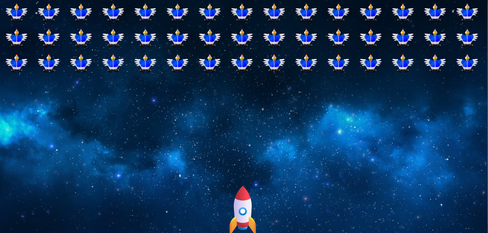
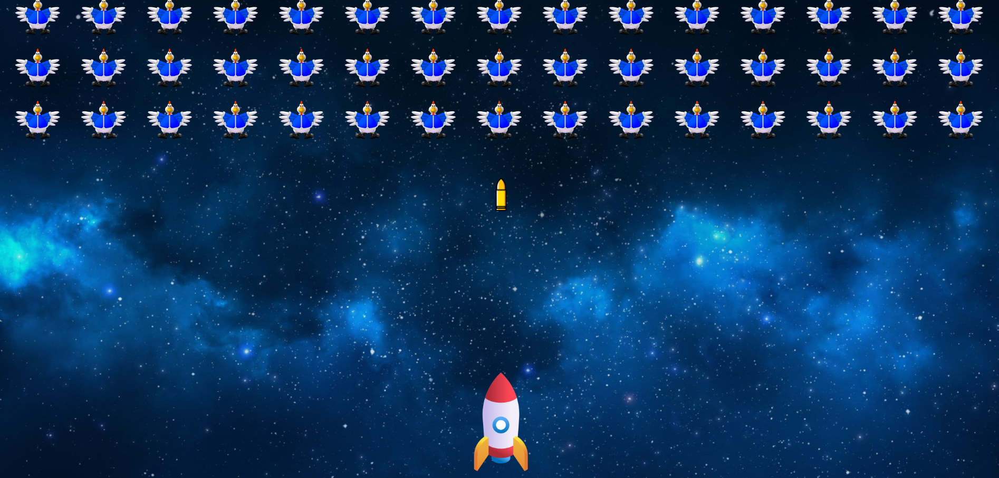

# Space Shooter Game

## Description

This is a simple HTML-based space shooter game created as part of the AMIT Fullstack course. The game features a player-controlled spaceship that can shoot at incoming enemies. It focuses on basic shooting mechanics without any damage or complex gameplay elements.

## Features

- **Player-controlled spaceship:** Move the ship using arrow keys or WASD.
- **Shooting mechanics:** Fire bullets to destroy enemies.
- **Enemy waves:** Challenging waves of enemies with increasing difficulty.
- **Score tracking:** Keep track of your high score.

## Getting Started

### Prerequisites

- A web browser (Chrome, Firefox, Safari, etc.)

### Installation

1. Clone the repository:
   ```bash
   git clone git@github.com:Muhammad-Ayman/ODC.git
   ```
2. Navigate to the project directory:

   ```bash
   cd spaceshooter
   ```

### Running the Game

Open `index.html` in your web browser.
Enjoy the game!

### Controls

Move: Arrow keys / WASD
Shoot: Spacebar

### Screenshots



